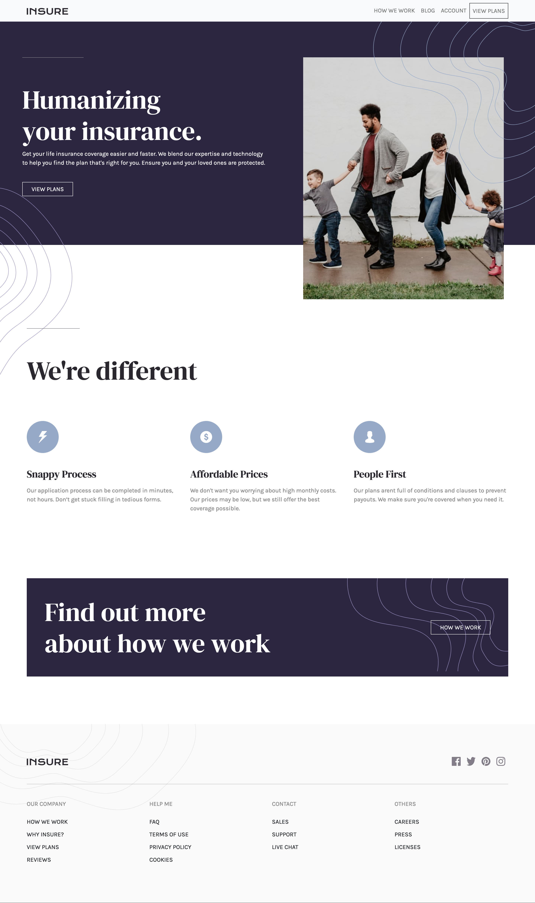

# Insure landing page solution

This is a solution to the [Insure landing page challenge on Frontend Mentor](https://www.frontendmentor.io/challenges/insure-landing-page-uTU68JV8).

## Overview


Users should be able to:

- View the optimal layout for the site depending on their device's screen size
- See hover states for all interactive elements on the page

### Screenshot



- Live Site URL: [https://atmkcmo.github.io/FM-insure-landing-page/](https://atmkcmo.github.io/FM-insure-landing-page/)


### Built with

- Sass
- Bootstap 4


### Project Setup

```sh
npm install
```

### Compile and Hot-Reload for Development

```sh
npm start
```

### Compile and Minify for Production

```sh
npx parcel build
```


## Author

- LinkedIn - [Adam McKee](https://www.linkedin.com/in/admckee/)
